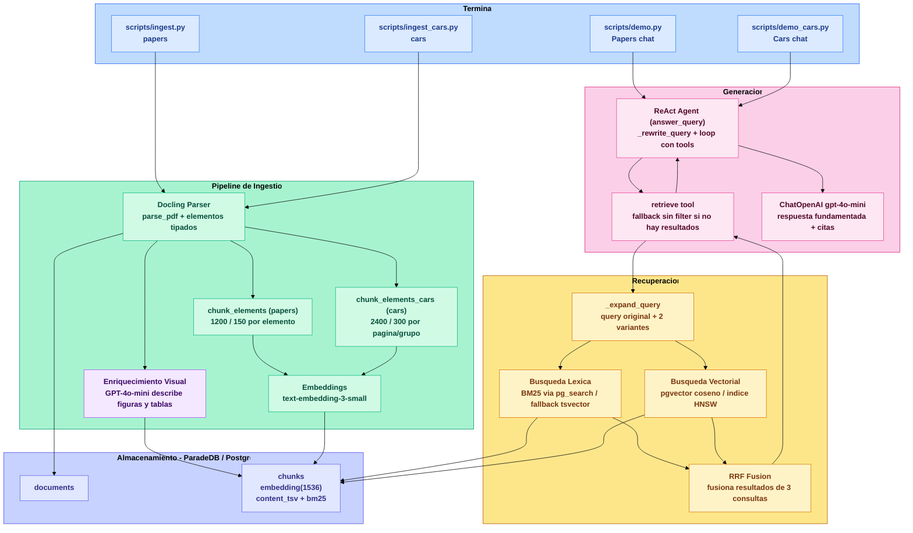
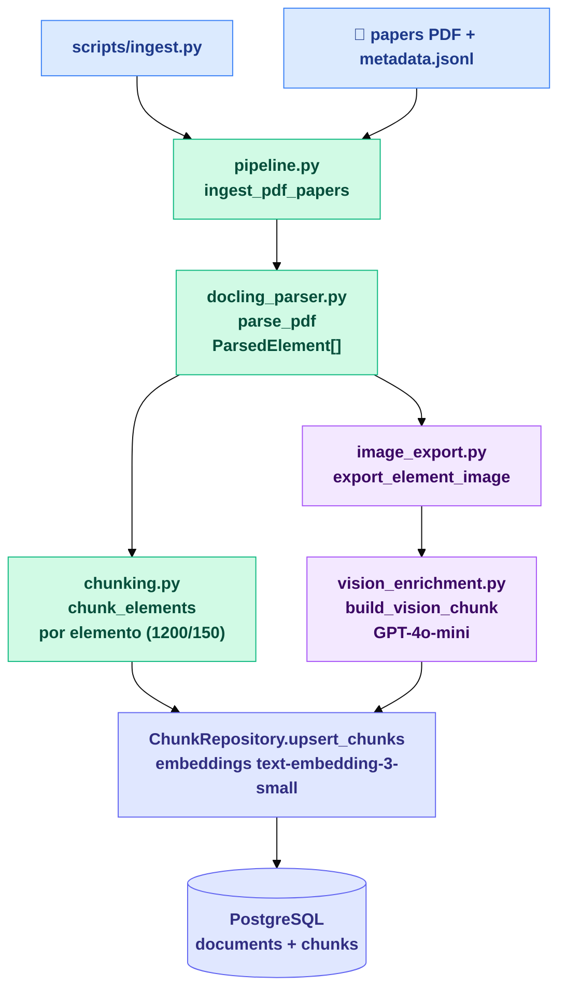
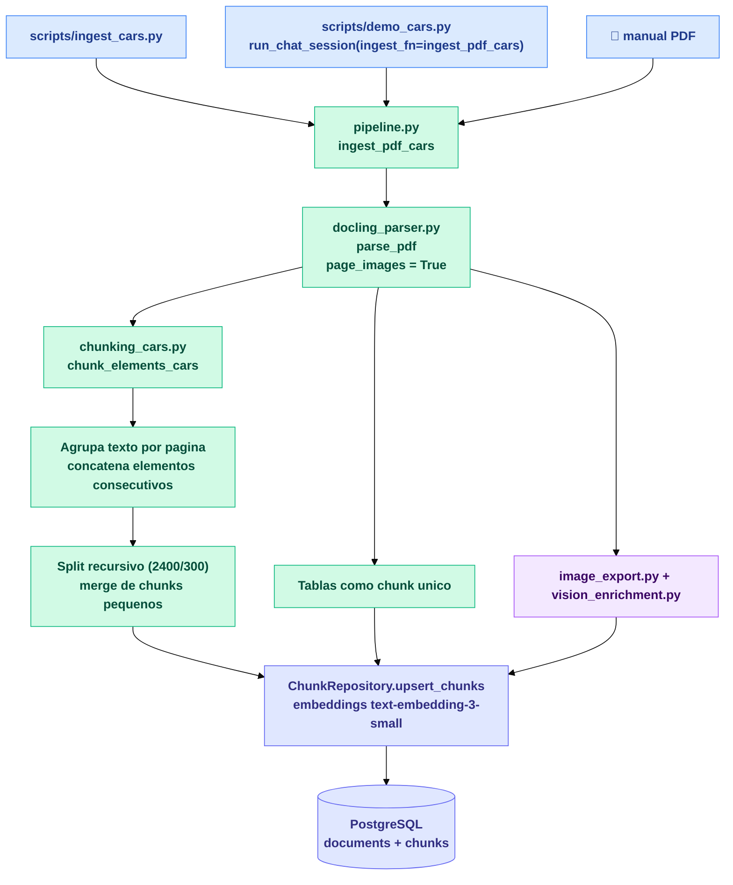
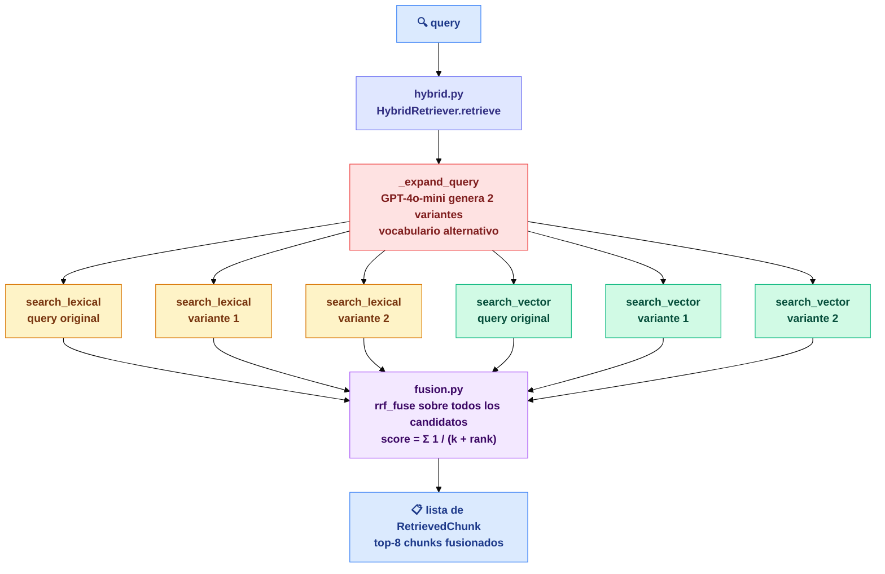
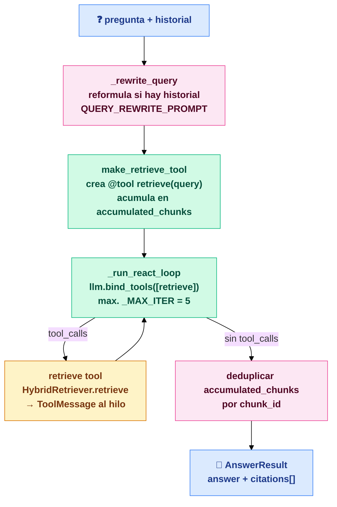
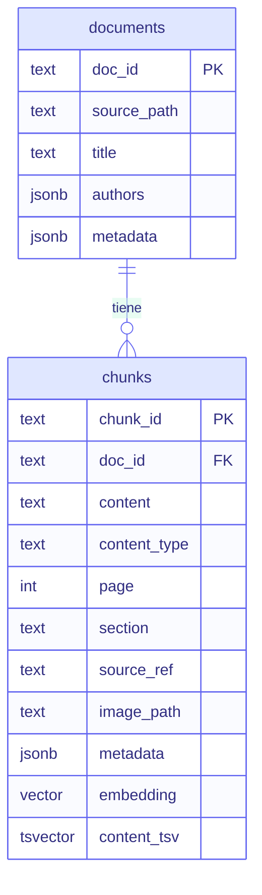
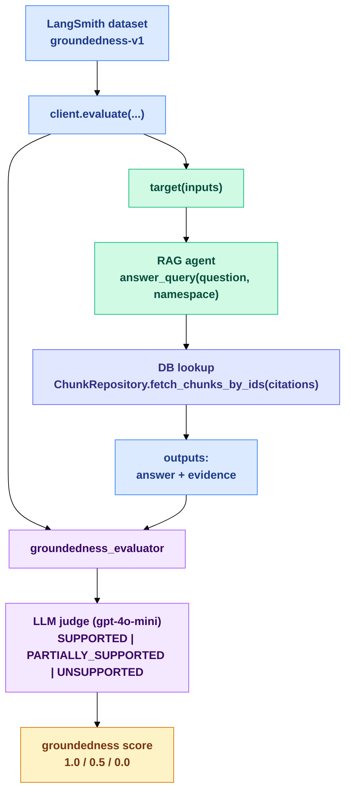
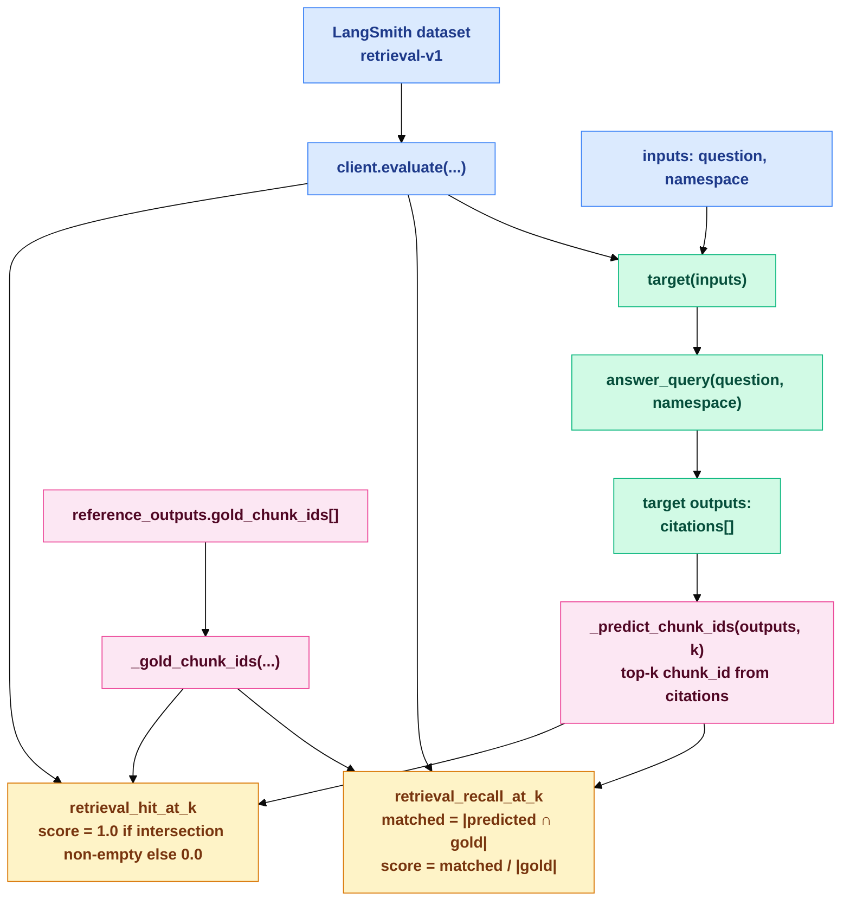

# Architecture

Compact architecture reference with diagram-first documentation and short context for each flow.

## System Overview

End-to-end view of ingestion, storage, retrieval, and answer generation from CLI entrypoints.

## Ingestion

### Papers Ingestion Flow

Scientific papers are parsed into typed elements, chunked by element, enriched with vision descriptions, and stored with embeddings.

### Cars Ingestion Flow

Car manuals use a dedicated chunking strategy (page/group oriented) to better preserve procedural instructions.

## Retrieval

Hybrid retrieval runs lexical and vector search over expanded queries, then fuses all rankings with RRF.

## RAG Agent

The ReAct loop decides when to call retrieval, accumulates evidence, and returns answer plus citations.

## Query And Retrieval Loop

Detailed control flow for query rewriting, filtered retrieval, fallback behavior, and iterative tool calls.

## Database Schema

Core storage model: `documents` as parent entities and `chunks` as the retrieval unit.

## Evals

### What we measure and how

- **Groundedness (`scripts/evals/run_groundedness_eval.py`)**: measures whether the generated answer is supported by retrieved evidence only.
- **How groundedness is scored**: the script runs `answer_query`, fetches cited chunks from storage, truncates evidence text, and asks an LLM judge for a strict JSON verdict:
  - `SUPPORTED` -> `1.0`
  - `PARTIALLY_SUPPORTED` -> `0.5`
  - `UNSUPPORTED` -> `0.0`
- **Retrieval coverage (`scripts/evals/run_retrieval_eval.py`)**: measures if retrieved citations contain gold chunks from the dataset labels.
- **How retrieval is scored** (top-k citations, default `k=8`):
  - `retrieval_recall_at_k`: `|predicted ∩ gold| / |gold|`
  - `retrieval_hit_at_k`: `1.0` if at least one gold chunk is in top-k, else `0.0`

### Groundedness Eval Flow

Execution flow from dataset input to LLM-as-judge groundedness feedback in LangSmith.

### Retrieval Eval Flow

Execution flow for `recall@k` and `hit@k` from predicted citations against gold chunk labels.

