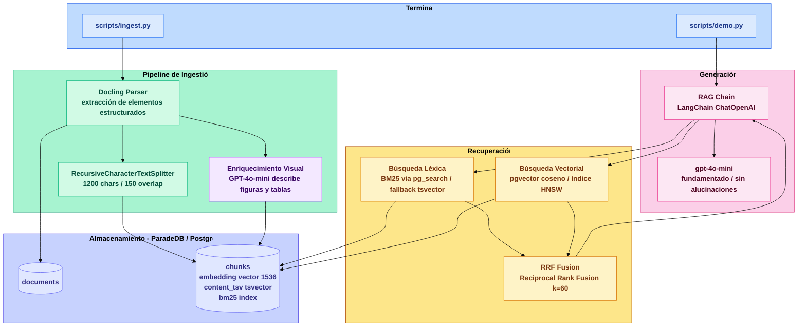
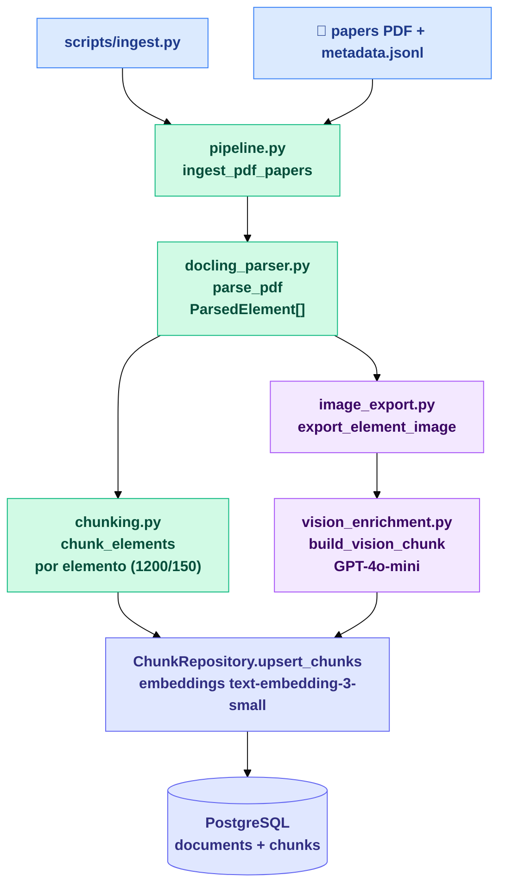
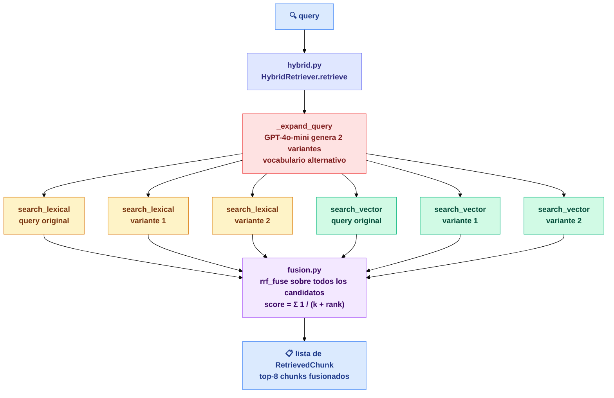
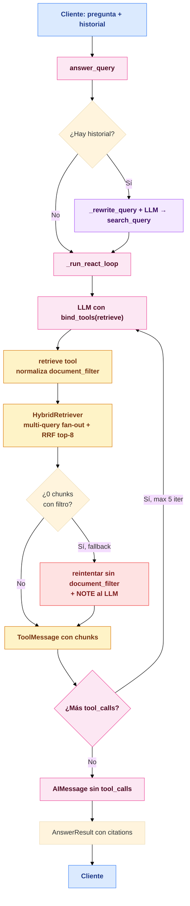
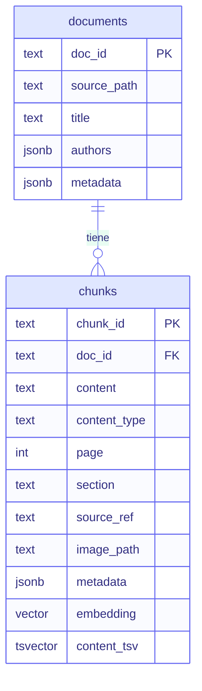

# Arquitectura

RAG multimodal local para PDFs científicos. Demuestra recuperación híbrida (BM25 + vectores), ingestión multimodal con Docling y generación fundamentada con citas — todo desde la terminal, sobre una única instancia de Postgres.

---

## Visión General del Sistema

---

## Ingestión

La ingestión tiene dos rutas explícitas e independientes: **papers** y **cars**. La elección ocurre en el entry point (`scripts/ingest.py`, `scripts/ingest_cars.py`, `scripts/demo_cars.py`) y cada pipeline llama su chunker específico sin condicionales por tipo de documento dentro de `pipeline.py`.

### Ingestión de papers

Ruta principal para papers científicos: `ingest.py` llama `ingest_pdf_papers()`, que usa el chunking histórico por elemento (`chunk_elements`) con `chunk_size=1200` y `chunk_overlap=150`.

**Estrategia papers (por elemento):**

- `table` se conserva como chunk único por elemento.
- `text` / `code` se divide con `RecursiveCharacterTextSplitter` respetando cortes naturales.
- IDs trazables: `{doc_id}:{element_idx}:{part_idx}`.
- Mantiene alta precisión para contenido técnico denso y secciones cortas.

### Ingestión de cars

Ruta para manuales de coche: `ingest_cars.py` y `demo_cars.py` llaman `ingest_pdf_cars()`, que usa `chunk_elements_cars()` para generar chunks más largos, orientados a instrucciones multi-bloque.

**Estrategia cars (por página/grupo):**

- Agrupa elementos consecutivos de texto por `page` antes de hacer split.
- Configuración dedicada: `chunk_size=2400`, `chunk_overlap=300`.
- Aplica merge de fragmentos cortos (umbral ~200 chars) para evitar chunks demasiado pequeños.
- `table` sigue como chunk individual para preservar estructura tabular.
- IDs trazables: `{doc_id}:p{page}:g{group}:{part}` para texto agrupado y `{doc_id}:table:{element_idx}:0` para tablas.

Estas dos rutas comparten parseo, enriquecimiento visual, embedding y persistencia, pero desacoplan completamente la estrategia de chunking para optimizar recuperación según el tipo de documento.

---

## Recuperación

`src/retrieval/` implementa búsqueda híbrida en paralelo: BM25 sobre el índice `pg_search` para coincidencia exacta de términos, y coseno sobre `pgvector` para similitud semántica. `fusion.py` combina ambas listas con Reciprocal Rank Fusion sin necesidad de normalizar puntuaciones.

### ¿Qué hace cada componente?

**Expansión de consulta — multi-query fan-out**

Antes de lanzar ninguna búsqueda, `_expand_query` invoca el LLM (temperatura 0.3) para generar 2 formulaciones alternativas de la consulta original con vocabulario distinto — sinónimos, términos relacionados y variaciones que un documento podría contener. Por ejemplo, "CD ejected automatically" puede expandirse a "disc player automatic ejection" y "compact disc player reject". La recuperación se ejecuta en paralelo para la consulta original y las dos variantes; todos los candidatos se acumulan antes de pasar por RRF. De este modo, un chunk que no comparte ningún término con la consulta original pero sí con una variante sigue siendo recuperable, aumentando el recall sin sacrificar precisión gracias a la fusión posterior.

**Normalización del filtro de documento**

El parámetro `document_filter` se normaliza antes de construir el patrón `ILIKE`: los espacios se sustituyen por `%` para que "Peugeot 5008" coincida con el `doc_id` `peugeot_5008` (que usa guiones bajos por ser el stem del nombre de fichero). Sin esta normalización, el filtro nunca produciría resultados en documentos cuyo nombre contiene espacios.

**Fallback de filtro sin resultados**

Si `document_filter` está activo pero devuelve cero chunks — por un nombre mal escrito o un documento no ingerido —, el `retrieve tool` en `chain.py` reintenta automáticamente la búsqueda sobre el corpus completo y añade una nota `NOTE:` al mensaje de herramienta para que el LLM sepa que los resultados provienen de un ámbito más amplio. Así se evita que el agente concluya erróneamente que no existe información sobre el tema.

**Búsqueda léxica — BM25**

BM25 es un algoritmo clásico de recuperación de información que busca por coincidencia exacta de palabras. Dado un texto de consulta, puntúa cada chunk según cuántas veces aparecen los términos de la consulta y ajusta ese recuento por la longitud del chunk (para no favorecer artificialmente los fragmentos más largos). Es ideal para términos técnicos concretos: si preguntas por "transformer attention mechanism", BM25 encontrará los chunks que contienen exactamente esas palabras. La implementación usa `pg_search` de ParadeDB con el operador `@@@`, con fallback automático a `tsvector` nativo de PostgreSQL si ParadeDB no está disponible.

**Búsqueda vectorial — similitud coseno**

La búsqueda vectorial funciona con significado, no con palabras exactas. Antes de almacenar cada chunk, su texto se convierte en un vector de 1536 números (un embedding) con `text-embedding-3-small` de OpenAI — una representación numérica del significado del texto. Cuando llega una consulta, se genera su embedding del mismo modo. La similitud coseno mide el ángulo entre los dos vectores: ángulo pequeño → vectores apuntando en la misma dirección → mismo significado. Así, una pregunta sobre "redes neuronales profundas" puede recuperar chunks que hablan de "deep learning" sin compartir ninguna palabra. El índice HNSW de `pgvector` hace que esta comparación sea muy rápida incluso con millones de chunks.

**RRF Fusion — Reciprocal Rank Fusion**

BM25 y la búsqueda vectorial devuelven puntuaciones en escalas completamente distintas (BM25 usa recuentos ponderados de términos, coseno devuelve valores entre 0 y 1), por lo que sumarlas directamente no tiene sentido. RRF evita ese problema ignorando las puntuaciones absolutas y usando solo la posición (rank) de cada chunk en cada lista. La fórmula `score = Σ 1 / (k + rank)` hace que un chunk que aparece en el puesto 1 de ambas listas acumule mucho más que uno que solo aparece en una. Con `k = 60`, los primeros puestos tienen peso significativo sin penalizar demasiado a los que aparecen más abajo. Con multi-query fan-out, todos los candidatos de las tres consultas compiten en una única pasada de fusión, lo que recompensa con mayor puntuación los chunks que aparecen bien posicionados en varias variantes. El resultado final son los 8 chunks con mejor puntuación combinada.

---

## RAG

`src/rag/` implementa un agente ReAct: `chain.py` reescribe la consulta cuando hay historial de conversación, expone el recuperador híbrido como herramienta LangChain (`@tool`) y ejecuta un bucle ReAct donde el LLM decide cuántas veces invocar `retrieve` antes de sintetizar la respuesta. Las citas se construyen a partir de todos los chunks acumulados a lo largo del bucle.

### Cómo se usa LangChain en este proyecto

LangChain se usa aquí como **capa de integración de agente**, aportando cuatro elementos clave:

- **`ChatOpenAI`** (`langchain_openai`): wrapper tipado sobre la API de chat de OpenAI que gestiona autenticación, serialización de mensajes y configuración del modelo (`gpt-4o-mini`, `temperature=0`).
- **`@tool`** (`langchain_core.tools`): decora la función `retrieve` para que el LLM pueda invocarla como herramienta. LangChain serializa automáticamente el esquema de entrada y parsea las llamadas del modelo.
- **`llm.bind_tools([retrieve])`**: registra la herramienta en el LLM habilitando el modo tool-use de la API de OpenAI.
- **Mensajes tipados** (`SystemMessage`, `HumanMessage`, `AIMessage`, `ToolMessage`): estructuran el hilo de conversación del agente — el `SystemMessage` lleva las instrucciones de comportamiento (rol, prohibición de alucinaciones y obligación de usar `retrieve`), los `HumanMessage`/`AIMessage` reconstruyen el historial y los `ToolMessage` devuelven los resultados de cada llamada a la herramienta.

### ¿Hay agentes en este pipeline?

Sí. El pipeline usa un **agente ReAct** (Reason + Act) implementado en `_run_react_loop`. A diferencia de un flujo de recuperación única y lineal, el LLM controla activamente cuántas veces recupera información:

1. `answer_query` reescribe la consulta con `_rewrite_query` si hay historial de conversación — resuelve pronombres y referencias para que la búsqueda sea autocontenida.
2. `make_retrieve_tool` crea una herramienta `retrieve` con `@tool` que llama a `HybridRetriever` y acumula los chunks devueltos en `accumulated_chunks`.
3. `_run_react_loop` invoca `llm.bind_tools([retrieve])` en un bucle (máximo `_MAX_ITER = 5`):
   - Si la respuesta contiene `tool_calls`, ejecuta `retrieve` y añade un `ToolMessage` al hilo de mensajes.
   - Si no hay `tool_calls`, el LLM ha sintetizado la respuesta final y el bucle termina.
4. Los chunks acumulados a lo largo de todas las llamadas a `retrieve` se deduplicaran por `chunk_id`.
5. `answer_query` construye los objetos `Citation` y devuelve el `AnswerResult` final.

El LLM elige activamente cuándo tiene suficiente contexto — puede llamar a `retrieve` varias veces con consultas distintas si la primera recuperación resulta insuficiente.

---

## Flujo de Ingestión

Cada PDF pasa por un pipeline de cuatro etapas que produce dos tipos de chunks: chunks de texto (prosa, tablas y código parseados) y chunks visuales (descripciones generadas por GPT-4o-mini de figuras y tablas extraídas).

```mermaid
%%{init: {'theme': 'base'}}%%
flowchart LR
    classDef pdf        fill:#FEF3C7,stroke:#D97706,color:#78350F,font-weight:bold
    classDef parse      fill:#DBEAFE,stroke:#3B82F6,color:#1E3A8A,font-weight:bold
    classDef chunk      fill:#D1FAE5,stroke:#10B981,color:#064E3B,font-weight:bold
    classDef vision     fill:#F3E8FF,stroke:#A855F7,color:#3B0764,font-weight:bold
    classDef store      fill:#E0E7FF,stroke:#6366F1,color:#312E81,font-weight:bold

    PDF["📄 Archivo PDF"]:::pdf --> PARSE

    subgraph SG1["1 - Parseo"]
        PARSE["Docling<br/>DocumentConverter<br/>imágenes de página habilitadas"]
    end

    subgraph SG2["2 - Chunking de texto"]
        SPLIT["RecursiveCharacterTextSplitter<br/>elementos text / code / table"]
    end

    subgraph SG3["3 - Descripción de imágenes"]
        EXPORT["Exportar PNGs<br/>./data/assets/"]
        GPT_V["GPT-4o-mini vision<br/>descripción max 120 palabras<br/>por figura/tabla"]
        EXPORT --> GPT_V
    end

    subgraph SG4["4 - Embedding y almacenamiento"]
        EMBED["text-embedding-3-small<br/>embedding en lote"]
        UPSERT["PostgreSQL upsert<br/>documents + chunks"]
        EMBED --> UPSERT
    end

    PARSE -->|elementos de texto| SPLIT
    PARSE -->|elementos figura/tabla| EXPORT
    SPLIT -->|ChunkRecords| EMBED
    GPT_V -->|figure_caption / table_caption| EMBED

    class PARSE parse
    class SPLIT chunk
    class EXPORT,GPT_V vision
    class EMBED,UPSERT store

    style SG1 fill:#BFDBFE,stroke:#2563EB,color:#000000,font-weight:bold
    style SG2 fill:#A7F3D0,stroke:#059669,color:#000000,font-weight:bold
    style SG3 fill:#E9D5FF,stroke:#9333EA,color:#000000,font-weight:bold
    style SG4 fill:#C7D2FE,stroke:#4F46E5,color:#000000,font-weight:bold
```

**Tipos de contenido almacenados:** `text`, `code`, `table`, `figure`, `figure_caption`, `table_caption`. Las figuras no se embeben directamente — solo sus descripciones generadas por GPT. Esto permite que la evidencia visual participe en la recuperación léxica y vectorial.

---

## Flujo de Consulta y Recuperación

**Fórmula RRF:** `score(chunk) = Σ 1 / (k + rank_i)` donde `k = 60`. Pesos iguales para las ramas léxica y vectorial. Con multi-query fan-out, los candidatos de las 3 consultas (original + 2 variantes) compiten en una única pasada de fusión. Ventana final de 8 chunks. Los chunks se acumulan a través de todas las iteraciones del bucle ReAct y se deduplicaran por `chunk_id` antes de construir las citas.

---

## Esquema de Base de Datos

**Índices sobre `chunks`:**

| Índice | Tipo | Propósito |
|---|---|---|
| `idx_chunks_bm25` | BM25 (`pg_search`) | Búsqueda léxica mediante operador `@@@` |
| `idx_chunks_content_tsv` | GIN | FTS de fallback cuando BM25 no está disponible |
| `idx_chunks_embedding_cosine` | HNSW | Búsqueda vectorial aproximada (ANN) |

---

## Modelos y Librerías

| Rol | Modelo / Librería |
|---|---|
| Parseo de PDFs | Docling `DocumentConverter` |
| División de texto | LangChain `RecursiveCharacterTextSplitter` |
| Embeddings | OpenAI `text-embedding-3-small` (1536 dims) |
| Descripción visual | OpenAI `gpt-4o-mini` (imagen a texto) |
| Chat / generación | OpenAI `gpt-4o-mini` via LangChain `ChatOpenAI` |
| Índice léxico | ParadeDB `pg_search` BM25, fallback `tsvector` |
| Índice vectorial | `pgvector` HNSW coseno |
| Fusión | Reciprocal Rank Fusion (implementación propia) |
| Agente ReAct | LangChain `@tool` + `bind_tools` + bucle propio |
| Reescritura de consulta | LangChain `ChatOpenAI` + `QUERY_REWRITE_PROMPT` |
| Trazabilidad | LangSmith `@traceable` |
| Orquestación | LangChain Core |

---

## Técnicas RAG de un Vistazo

| Técnica | Descripción |
|---|---|
| **Parseo estructurado** | Docling preserva encabezados, figuras, tablas y bloques de código como elementos tipados — evita volcados de texto plano |
| **Chunks multimodales** | Figuras y tablas se exportan como PNGs, se describen con un LLM visual y se almacenan como chunks recuperables |
| **Chunking recursivo** | Chunks de 1200 caracteres con 150 de overlap mantienen la continuidad semántica entre divisiones |
| **Recuperación híbrida** | BM25 para coincidencia exacta de palabras clave + coseno denso para similitud semántica, en paralelo |
| **Multi-query fan-out** | Antes de recuperar, el LLM genera 2 variantes de la consulta con vocabulario alternativo; todos los candidatos compiten en una única pasada de RRF, aumentando el recall frente a brechas terminológicas |
| **Normalización de filtro** | Los espacios en `document_filter` se sustituyen por `%` en el patrón `ILIKE` para que "Peugeot 5008" coincida con el `doc_id` `peugeot_5008` independientemente del separador |
| **Fallback de filtro** | Si `document_filter` produce cero resultados, el `retrieve tool` reintenta sin filtro y notifica al LLM mediante un mensaje `NOTE:`, evitando respuestas vacías por filtros que no encuentran coincidencia |
| **Reciprocal Rank Fusion** | Fusiona todas las listas ordenadas (de las 3 consultas × 2 motores) sin necesidad de normalizar puntuaciones |
| **Agente ReAct** | El LLM controla cuántas veces llama al recuperador (máx. 5) antes de sintetizar — puede lanzar consultas distintas si la primera es insuficiente |
| **Reescritura de consulta** | En conversaciones multi-turno, la pregunta se reformula para resolver pronombres y referencias antes de la recuperación |
| **Conversación multi-turno** | El historial completo (hasta 10 turns) se inyecta en el hilo de mensajes del agente |
| **Generación fundamentada** | El system prompt instruye al modelo a responder solo desde el contexto y a señalar incertidumbre |
| **Citas estructuradas** | Cada respuesta devuelve objetos `Citation` (doc, chunk, página, source_ref) para trazabilidad |
