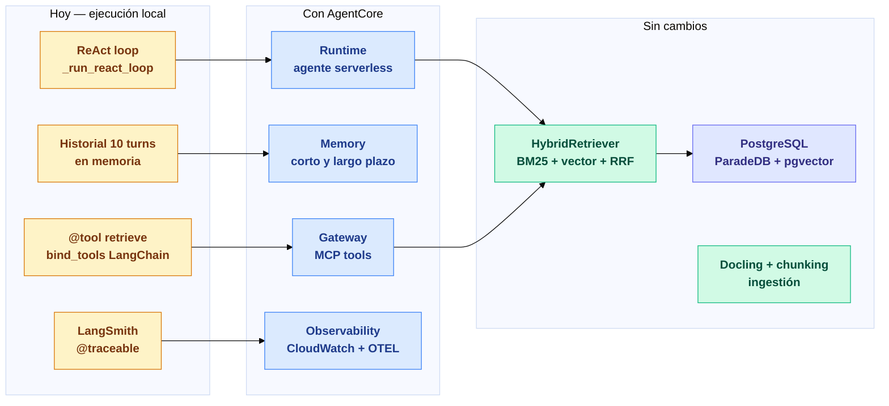

# AWS AgentCore — Qué es y cómo encaja en esta aplicación

## 1. ¿Qué es AWS AgentCore?

AWS AgentCore (oficialmente **Amazon Bedrock AgentCore**) es la plataforma de AWS para construir, desplegar y operar agentes de IA en producción — sin gestionar la infraestructura que los hace funcionar.

Fue anunciado como respuesta a un problema concreto: los equipos de ingeniería construyen prototipos de agentes con facilidad, pero llevarlos a producción requiere resolver seguridad, escalado, persistencia de contexto, monitorización y gestión de herramientas — trabajo de infraestructura que no aporta valor de negocio. AgentCore resuelve eso como servicio gestionado.

Es framework-agnóstico: funciona con LangChain, LangGraph, LlamaIndex, CrewAI, Strands o cualquier implementación propia. También es model-agnóstico: puede usar cualquier modelo de Bedrock (Claude, Llama, Mistral) o modelos externos como GPT-4o.

---

## 2. El problema que resuelve

Pasar un agente de prototipo a producción implica resolver, sin ayuda, toda una capa de infraestructura:

| Problema | Sin AgentCore | Con AgentCore |
|---|---|---|
| **Despliegue y escalado** | Contenedores propios, ECS, K8s, cold starts | Serverless gestionado, escalado automático |
| **Memoria entre sesiones** | Base de datos propia, lógica de ventana de contexto | Servicio de memoria gestionado (corto y largo plazo) |
| **Exposición de herramientas** | APIs ad-hoc, integración manual con el LLM | Gateway MCP-compatible, un solo endpoint seguro |
| **Identidad y permisos** | IAM manual, secretos en variables de entorno | Identidades verificables por agente, acceso fine-grained |
| **Monitorización** | Logs dispersos, trazas en LangSmith | Dashboards CloudWatch, OpenTelemetry nativo |
| **Evaluación** | Preguntas manuales de evaluación | Evaluación automática de calidad del agente |

La promesa es que el equipo se centra en la lógica del agente, no en la infraestructura que lo rodea.

---

## 3. Los servicios que lo componen

AgentCore no es un monolito — son nueve servicios modulares que se pueden usar de forma independiente o combinada:

```mermaid
%%{init: {'theme': 'base'}}%%
flowchart TD
    classDef core    fill:#DBEAFE,stroke:#3B82F6,color:#1E3A8A,font-weight:bold
    classDef tool    fill:#D1FAE5,stroke:#10B981,color:#064E3B,font-weight:bold
    classDef ops     fill:#FEF3C7,stroke:#D97706,color:#78350F,font-weight:bold
    classDef preview fill:#F3E8FF,stroke:#A855F7,color:#3B0764,font-weight:bold

    AGENT["🤖 Tu agente<br/>(cualquier framework)"]:::core

    AGENT --> RT["Runtime<br/>entorno serverless<br/>hasta 8h de ejecución"]:::core
    AGENT --> MEM["Memory<br/>contexto corto y largo plazo<br/>entre sesiones"]:::core
    AGENT --> GW["Gateway<br/>herramientas MCP-compatible<br/>desde APIs y Lambdas"]:::tool
    AGENT --> ID["Identity<br/>identidad verificable por agente<br/>acceso fine-grained"]:::tool
    AGENT --> OBS["Observability<br/>logs, trazas, dashboards<br/>CloudWatch + OpenTelemetry"]:::ops
    AGENT --> BI["Browser Tool<br/>navegador en la nube<br/>para agentes web"]:::tool
    AGENT --> CI["Code Interpreter<br/>ejecución de código<br/>en sandbox seguro"]:::tool
    AGENT --> EVAL["Evaluations ⚠️<br/>calidad del agente<br/>automatizada"]:::preview
    AGENT --> POL["Policy ⚠️<br/>límites de acción<br/>del agente"]:::preview
```



*⚠️ En preview — no disponible con carácter general todavía.*

### Runtime

Entorno serverless donde se despliega el agente. Gestiona cold starts rápidos, aislamiento de sesiones y tiempos de ejecución extendidos (hasta 8 horas para tareas largas). Compatible con cualquier framework mediante el SDK de AgentCore.

### Memory

Sistema de memoria gestionado en dos capas:

- **Memoria de corto plazo** — el contexto de la conversación actual, equivalente al historial de mensajes que hoy gestiona el agente manualmente.
- **Memoria de largo plazo** — conocimiento persistente entre sesiones. El agente puede "recordar" preferencias, resultados previos o hechos aprendidos en conversaciones anteriores.

### Gateway

Convierte cualquier API REST, función Lambda o servicio existente en una herramienta compatible con Model Context Protocol (MCP). El agente accede a todas sus herramientas desde un único endpoint seguro y con autenticación centralizada. Elimina la integración manual de herramientas con `bind_tools`.

### Observability

Logging, trazas distribuidas y dashboards de monitorización integrados con CloudWatch Application Signals y OpenTelemetry. Permite visualizar el camino completo de ejecución del agente — cada decisión, cada llamada a herramienta, cada respuesta generada.

---

## 4. AgentCore vs arquitectura local

La aplicación actual funciona completamente en local sobre un único proceso Python. AgentCore representa el camino hacia producción:

| | Esta aplicación (local) | Con AgentCore |
|---|---|---|
| **Ejecución del agente** | Proceso Python en terminal | Runtime serverless con escalado automático |
| **Historial de conversación** | 10 turns en memoria, volátil | Memory gestionada, persistente entre sesiones |
| **Herramientas del agente** | `@tool retrieve` con LangChain `bind_tools` | Gateway MCP con endpoint único y autenticación |
| **Trazabilidad** | LangSmith `@traceable` | CloudWatch + OpenTelemetry, dashboards nativos |
| **Modelos** | OpenAI GPT-4o-mini | Claude, Llama, Mistral u OpenAI vía Bedrock |
| **Despliegue** | `python scripts/demo.py` | API gestionada con sesiones aisladas |
| **Identidad** | Variable de entorno `OPENAI_API_KEY` | IAM por agente, acceso fine-grained a recursos |

---

## 5. Cómo encajaría en esta aplicación

Cada componente de la aplicación tiene un destino natural dentro de AgentCore:



### Lo que no cambiaría

La capa de recuperación — `HybridRetriever`, los índices BM25 y vectorial en PostgreSQL, y la lógica de RRF — no requiere ninguna modificación. AgentCore no sustituye la búsqueda; la orquesta.

La ingestión (Docling, chunking, embeddings, almacenamiento) tampoco cambia. AgentCore opera sobre los documentos ya ingestados.

### Lo que cambiaría

**1. El agente ReAct** dejaría de ser el bucle propio `_run_react_loop` y pasaría a ejecutarse dentro del **Runtime** de AgentCore. El mismo código LangChain puede desplegarse con cambios mínimos usando el SDK de AgentCore.

**2. El historial de conversación** — actualmente un slice de los últimos 10 turnos inyectado manualmente en el hilo de mensajes — pasaría a gestionarlo el servicio **Memory**. Esto elimina el límite de 10 turnos y añade memoria persistente entre sesiones: el agente puede recordar que un usuario ya tiene ingestado el manual del Peugeot 5008.

**3. La herramienta `retrieve`** — hoy registrada con `@tool` y `bind_tools` de LangChain — se publicaría en el **Gateway** como herramienta MCP. Desde ahí, cualquier agente del ecosistema puede llamarla con autenticación centralizada, sin que cada agente tenga que integrar la librería manualmente.

**4. La trazabilidad** de LangSmith pasaría a complementarse (o sustituirse) con el sistema de **Observability** de AgentCore: trazas distribuidas en CloudWatch (Application Signals), dashboards de métricas operativas y soporte OpenTelemetry para integraciones con herramientas externas.

---

## 6. Qué habría que cambiar en el código

La migración es mayoritariamente trabajo de adaptador, no una reescritura:

| Componente | Cambio necesario |
|---|---|
| `src/rag/chain.py` | Envolver el agente con el SDK de AgentCore Runtime |
| `src/rag/chain.py` — historial | Sustituir el slice de 10 turnos por llamadas al servicio Memory |
| `src/retrieval/hybrid.py` | Exponer `retrieve()` como herramienta MCP vía Gateway |
| `src/ingest/` | Sin cambios — ingestión sigue igual |
| `src/retrieval/` | Sin cambios — BM25, vector y RRF siguen igual |
| `src/db/` | Sin cambios — PostgreSQL sigue siendo el almacén |
| Modelos (OpenAI → Bedrock) | Cambiar clientes: `ChatOpenAI` → cliente Bedrock, `text-embedding-3-small` → embedding Bedrock |

Los límites entre módulos (`ingest`, `retrieval`, `rag`) están diseñados para que cada capa sea sustituible de forma independiente — exactamente el desacoplamiento que hace viable esta migración.

---

## 7. Ejemplos de código

Los ejemplos siguientes son fragmentos simplificados que muestran cómo se traducen los tres componentes principales de la aplicación a AgentCore.

---

### 7.1 Runtime — desplegar el agente como servicio

**Hoy** — el agente vive dentro de `scripts/demo_cars.py` y se ejecuta como proceso local:

```python
# scripts/demo_cars.py (actual)
from src.rag.chain import answer_query

result = answer_query(question, namespace="cars", conversation_history=history)
print(result.answer)
```

**Con AgentCore Runtime** — se envuelve `answer_query` con `BedrockAgentCoreApp`, que expone automáticamente los endpoints `/invocations` y `/ping` y gestiona el ciclo de vida del proceso:

```python
# agent_entrypoint.py (nuevo)
from bedrock_agentcore import BedrockAgentCoreApp
from src.rag.chain import answer_query

app = BedrockAgentCoreApp()

@app.entrypoint
def invoke(payload: dict, context) -> dict:
    result = answer_query(
        question=payload["question"],
        namespace=payload.get("namespace", "cars"),
        conversation_history=payload.get("history", []),
    )
    return {"answer": result.answer, "citations": [...]}

app.run()
```

El despliegue desde la CLI del toolkit:

```bash
pip install bedrock-agentcore-starter-toolkit
agentcore deploy --entrypoint agent_entrypoint.py --region us-east-1
```

AgentCore construye la imagen, la sube y gestiona el escalado — sin Dockerfile ni configuración de ECS.

---

### 7.2 Memory — memoria persistente entre sesiones

**Hoy** — el historial es volátil y tiene un límite fijo de 10 turnos en `chain.py`:

```python
# src/rag/chain.py (actual)
_MAX_HISTORY_TURNS = 10

def _rewrite_query(question, conversation_history, llm):
    history_turns = conversation_history[-_MAX_HISTORY_TURNS:]  # se pierde al reiniciar
    ...
```

**Con AgentCore Memory (SDK directo)** — se añade `MemoryClient` de `bedrock-agentcore` al flujo existente de `answer_query`. Sin LangGraph, sin reescribir el bucle ReAct:

```python
# src/rag/memory.py (nuevo)
from bedrock_agentcore.memory import MemoryClient

MEMORY_ID = "arn:aws:bedrock:us-east-1::memory/my-rag-memory"
_client = MemoryClient(region_name="us-east-1")

def load_history(actor_id: str, session_id: str) -> list[dict]:
    """Recupera los turnos anteriores desde AgentCore Memory."""
    events = _client.list_events(
        memory_id=MEMORY_ID,
        actor_id=actor_id,
        session_id=session_id,
    )
    history = []
    for role, content in events.get("messages", []):
        history.append({"role": role.lower(), "content": content})
    return history

def save_turn(actor_id: str, session_id: str, question: str, answer: str) -> None:
    """Persiste el turno actual en AgentCore Memory."""
    _client.create_event(
        memory_id=MEMORY_ID,
        actor_id=actor_id,
        session_id=session_id,
        messages=[
            (question, "USER"),
            (answer, "ASSISTANT"),
        ],
    )
```

En `agent_entrypoint.py`, se reemplaza la lista `conversation_history` del payload por llamadas a estas dos funciones:

```python
# agent_entrypoint.py (con memoria)
from src.rag.memory import load_history, save_turn
from src.rag.chain import answer_query

@app.entrypoint
def invoke(payload: dict, context) -> dict:
    actor_id   = payload["actor_id"]    # identifica al usuario
    session_id = payload["session_id"]  # identifica la conversación

    # Cargar historial persistido (sustituye el slice de 10 turnos)
    history = load_history(actor_id, session_id)

    result = answer_query(
        question=payload["question"],
        namespace=payload.get("namespace", "cars"),
        conversation_history=history,
    )

    # Persistir el turno para la próxima llamada
    save_turn(actor_id, session_id, payload["question"], result.answer)

    return {"answer": result.answer, "citations": [...]}
```

`chain.py` no necesita ningún cambio — sigue recibiendo `conversation_history` como lista de dicts, exactamente igual que ahora. El historial ya no está limitado a 10 turnos y sobrevive a reinicios del proceso.

---

### 7.3 Gateway — exponer el recuperador como herramienta MCP

**Hoy** — `HybridRetriever.retrieve()` se registra manualmente con `@tool` de LangChain y solo lo puede usar el agente local:

```python
# src/rag/chain.py (actual)
from langchain_core.tools import tool

def make_retrieve_tool(namespace, accumulated_chunks):
    retriever = HybridRetriever(namespace=namespace)

    @tool
    def retrieve(query: str, document_filter: str | None = None) -> str:
        """Search the document corpus..."""
        chunks = retriever.retrieve(query, document_filter=document_filter)
        ...
    return retrieve

llm.bind_tools([retrieve_tool])  # integración manual por agente
```

**Con AgentCore Gateway** — el recuperador se publica como una herramienta MCP con un único endpoint seguro. Cualquier agente del ecosistema puede llamarla sin integrar la librería:

```python
# setup_gateway.py (nuevo)
import boto3

client = boto3.client("bedrock-agentcore", region_name="us-east-1")

# Registrar la herramienta retrieve como función Lambda
response = client.create_gateway_target(
    gatewayId="my-rag-gateway",
    name="hybrid-retrieve",
    description="Búsqueda híbrida BM25 + vectorial sobre documentos ingestados",
    targetConfiguration={
        "lambda": {
            "lambdaArn": "arn:aws:lambda:us-east-1:123456789:function:hybrid-retrieve",
            "inputSchema": {
                "type": "object",
                "properties": {
                    "query": {"type": "string"},
                    "namespace": {"type": "string", "enum": ["papers", "cars"]},
                },
                "required": ["query"],
            },
        }
    },
)

# El agente llama a la herramienta a través del endpoint MCP del Gateway
# sin importar el framework que use
```

---

### 7.4 Observability — trazas con OpenTelemetry

**Hoy** — la trazabilidad usa LangSmith con el decorador `@traceable`:

```python
# src/rag/chain.py (actual)
from langsmith import traceable

@traceable(name="answer_query")
def answer_query(question, namespace, conversation_history, system_prompt):
    ...
```

**Con AgentCore Observability** — se añade un exportador OpenTelemetry que envía trazas a CloudWatch. Es compatible con el `@traceable` existente o puede sustituirlo:

```python
# observability.py (nuevo)
from opentelemetry import trace
from opentelemetry.sdk.trace import TracerProvider
from opentelemetry.sdk.trace.export import BatchSpanProcessor
from aws_opentelemetry_distro import AwsOpenTelemetryConfigurator

AwsOpenTelemetryConfigurator().configure()
tracer = trace.get_tracer("rag-agent")

# Decorar answer_query con trazas nativas
with tracer.start_as_current_span("answer_query") as span:
    span.set_attribute("question", question)
    span.set_attribute("namespace", namespace)
    result = answer_query(question, namespace, conversation_history)
    span.set_attribute("citations.count", len(result.citations))
```

Los spans aparecen automáticamente en los dashboards de CloudWatch Application Insights, con la traza completa del bucle ReAct — qué herramientas llamó el agente, en qué orden y cuánto tardó cada paso.

---

## En una frase

> AWS AgentCore convierte el agente ReAct local en un servicio de producción gestionado — sin tocar la recuperación híbrida ni la base de datos — añadiendo memoria persistente, herramientas MCP y monitorización nativa de CloudWatch.
