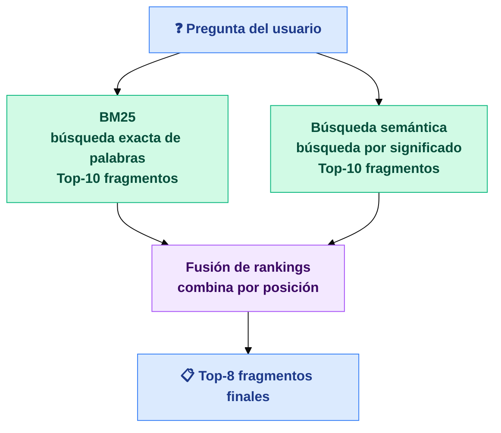

# BM25 — Qué es y cómo funciona en esta aplicación

## 1. ¿Qué es BM25?

BM25 es un algoritmo de ranking probabilístico que decide **qué textos son más relevantes para una búsqueda** comparando las palabras de la pregunta con las palabras de cada documento.

Fue creado en los años 80 por investigadores de la City University de Londres y, cuatro décadas después, sigue siendo la base de la mayoría de motores de búsqueda del mundo — incluyendo Elasticsearch, el buscador interno de Amazon o el de Wikipedia.

---

## 2. La idea detrás de BM25

Cuando alguien busca *"presión neumáticos Peugeot 5008"*, BM25 busca esas palabras exactas en todos los documentos disponibles y los ordena según tres criterios:

- **¿Aparecen las palabras?** Los documentos que contienen los términos buscados suben en el ranking.
- **¿Son palabras raras o comunes?** Una palabra muy común (como "el" o "tiene") no aporta señal de relevancia. Una palabra específica como "neumático" o "Peugeot" sí.
- **¿El documento es muy largo?** Un capítulo de 50 páginas puede mencionar "frenos" 30 veces solo por ser largo. BM25 lo corrige para no favorecer textos largos artificialmente.

---

## 3. ¿Cómo se usa normalmente?

BM25 vive dentro de un buscador y trabaja de forma invisible cuando alguien escribe en una barra de búsqueda.

### Dónde aparece en el mundo real

| Sistema | Contexto |
|---|---|
| **Elasticsearch / OpenSearch** | Búsqueda interna en empresas, logs, wikis |
| **Amazon, Mercado Libre** | Búsqueda de productos en e-commerce |
| **Wikipedia** | Búsqueda de artículos |
| **Sistemas legales y médicos** | Búsqueda exacta en contratos, expedientes clínicos |
| **Aplicaciones RAG** | Recuperación de fragmentos de documentos para responder preguntas |

---

## 4. BM25 vs búsqueda por significado

Hay otra forma de buscar: en lugar de comparar palabras exactas, se compara el **significado** de la pregunta con el significado de cada fragmento de texto. Es lo que hace la búsqueda vectorial.

Ambas tienen sus puntos fuertes:

| | BM25 | Búsqueda por significado |
|---|---|---|
| Funciona bien para... | Términos exactos, códigos, nombres propios | Sinónimos, preguntas en otras palabras |
| Puede fallar cuando... | El usuario parafrasea la pregunta | El término buscado es muy específico o técnico |
| Necesita inteligencia artificial | No | Sí |
| Velocidad | Muy rápida | Más lenta |

**La mejor solución es combinar las dos** — exactamente lo que hace esta aplicación.

---

## 5. Cómo funciona en esta aplicación

Cuando un usuario hace una pregunta, la aplicación lanza dos búsquedas en paralelo y combina los resultados:

- **BM25** busca en la base de datos usando el motor `pg_search` de ParadeDB, una extensión de PostgreSQL diseñada para búsqueda de texto.
- **Fusión:** los dos rankings se combinan por posición — no por puntuación — para evitar que una escala domine a la otra.

---

## 6. Cómo está configurado en nuestra base de datos

La aplicación usa **PostgreSQL** con dos extensiones instaladas al arrancar:

- **`pg_search`** (ParadeDB) — añade el soporte BM25 nativo.
- **`pgvector`** — añade el soporte de búsqueda por vectores.

Cada fragmento de texto se guarda en la tabla `chunks`. Sobre esa tabla hay tres índices de búsqueda, uno por tipo:

| Índice | Tipo | Para qué sirve |
|---|---|---|
| `idx_chunks_bm25` | BM25 (`pg_search`) | Búsqueda exacta de palabras — el que usa esta sección |
| `idx_chunks_content_tsv` | GIN (PostgreSQL nativo) | Búsqueda de texto de respaldo si `pg_search` no está disponible |
| `idx_chunks_embedding_cosine` | HNSW | Búsqueda por significado (vectores) |

Cuando el usuario hace una pregunta, la búsqueda BM25 se ejecuta con el operador `@@@` de ParadeDB directamente en SQL, y devuelve los 10 fragmentos más relevantes. Si ParadeDB no está disponible, se activa automáticamente el índice de respaldo.

Los fragmentos de BM25 y los de búsqueda por significado llegan juntos a la fase de fusión, donde se combinan por posición en el ranking para producir los 8 resultados finales.

---

## En una frase

> BM25 encuentra los fragmentos donde aparecen exactamente las palabras que el usuario escribió — rápido, sin inteligencia artificial, y sin dejarse engañar por documentos largos o palabras muy comunes.
